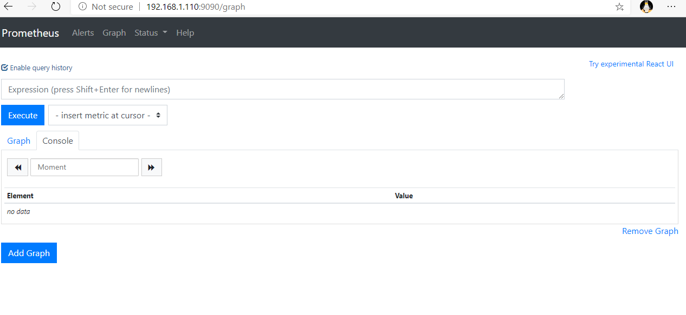
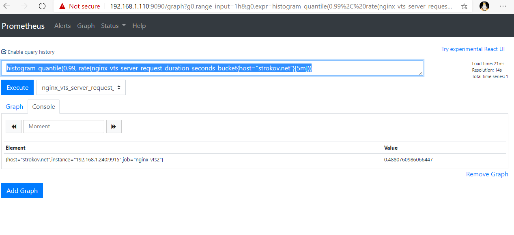
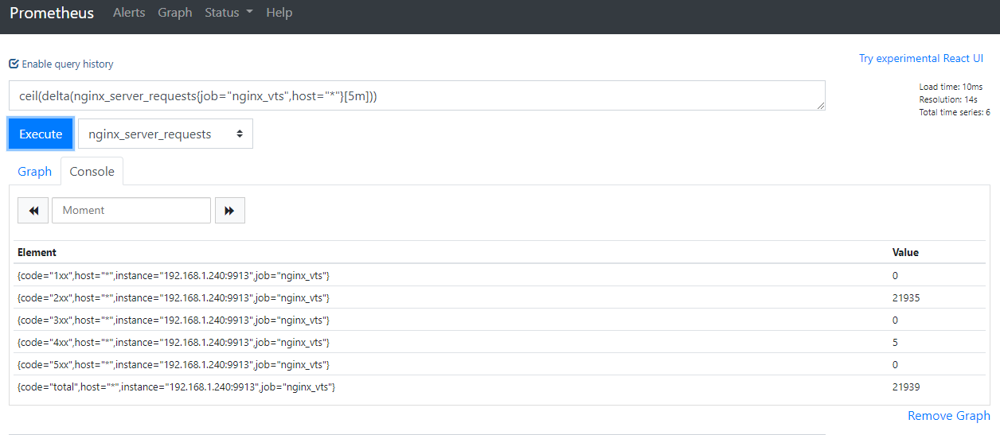
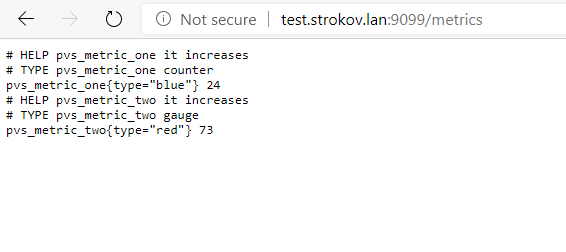

# otus-lab-2
# Установка и настройка Prometheus, использование exporters
Цель: Необходимо собрать стенд включающий в себя 2 виртуальные машины: 
1. Prometheus 
2. Nginx На вм с nginx установить и настроить nginx-exporter. 

С помощью siege (или apache benchmark, или yandex tank) устроить ипровизированное нагрузочное тестирование. 
Посчитать 99й персентиль по времени ответа за 5 минут. 
Посчитать количество запросов по каждому коду ответа за 5 минут. 
Реализовать свой собственный экспортер с собственными метриками (ваше имя\никнейм в название метрики) использую любой ЯП. (Ссылка с реализацией экспортера на bash прилагается) 
Для сдачи: 
1. Скриншоты с prometheus с результатами запросов PromQL 
2. Текстовый файлик с примерами метрик вашего экспортера

# Установка prometheus.
Всё по инструкции. Делаем от root или используем sudo.
Скачиваем последнюю версию с официального сайта.
Распаковываем полученнный архив.
Создаём пользователя prometheus.
Копируем файлы prometheus, promtool, tsdb в /usr/local/bin.
Назначаем права выполнения пользователю prometheus на эти файлы.
Создаём папки /etc/prometheus и /var/lib/prometheus.
Назначаем владельцем пользователя prometheus.
Копируем файл prometheus.yml и каталоги console, colsole_libraries в /etc/prometheus.  
Так же делаем их владельцем пользователя prometheus.

Создаём файл /etc/systemd/system/prometheus.service
вписываем в него
```plaintext
[Unit]
Description=Prometheus Service
After=network.target

[Service]
User=prometheus
Group=prometheus
Type=simple
ExecStart=/usr/local/bin/prometheus \
--config.file /etc/prometheus/prometheus.yml \
--storage.tsdb.path /var/lib/prometheus/ \
--web.console.templates=/etc/prometheus/consoles \
--web.console.libraries=/etc/prometheus/console_libraries
ExecReload=/bin/kill -HUP $MAINPID
Restart=on-failure

[Install]
WantedBy=multi-user.target
```
Просим демона перечитать конфиги.
```bash
systemctl daemon-reload
```
Затем включаем автозапуск и запускаем prometheus
```bash
systemctl enable prometheus
systemctl start prometheus
```
Проверяем состояние демона

```bash
systemctl status prometheus
```
Разрешаем доступ с других машин к портам prometheus

```bash
firewall-cmd --permanent --add-port=9090/tcp --add-port=9093/tcp --add-port=9094/{tcp,udp} --add-port=9100/tcp
firewall-cmd --reload
```
Идём браузером на сервер, где установлен prometheus а порт 9090.
Результат.


На рабочей машине с nginx устанавливаем nginx-exporter.
Всего 9 метрик. Задача не решается.
Устанавливаем nginx_vts_exporter.
Для этого компилируем и подключаем модуль nginx-module-vts.  
Настраиваем вывод расширенной информации.
Лучше, можно получать метрики по кодам ответов, но нет метрик типа histogram. Нельзя посчитать перцентиль.

Чтение документации модуля показало, что поддержку histogram нужно включать явно для виртуального хоста, который будем мониторить.

В nginx_vts_exporter новые метрики не появились, хотя basic_status показал, что они есть.
Так как добавленный модуль имеет поддержку prometheus будем использовать встроенный экспортер.
В /etc/nginx/conf.d создаём новый файл prometheus.conf
Вписываем в него следующее:
```plaintext
server {
    listen       xxx.xxx.xxx.xxx:9915;
    server_name  exporter;
    location /metrics {
        proxy_pass  http://localhost/basic_status/format/prometheus;
    }
}
```
Теперь prometheus может штатно использовать метрики непосредственно с nginx.
Настраиваем prometheus на опрос метрик nginx. 
Добавляем job в /etc/prometheus/prometheus.yml
```yaml
- job_name: 'nginx_vts2'
  scrape_interval: 1s
  static_configs:
  - targets: ['xxx.xxx.xxx.xxx:9915']
```

Перезапускаем prometheus и убеждаемся что данные идут.

Устанавливаем siege на тестовой машине и проводим нагрузочное тестирование виртуального хоста, на котором включена поддержка histogram. Присутствует строка вида:
  
vhost_traffic_status_histogram_buckets 0.005 0.01 0.05 0.1 0.5 1 5 10;  

Убеждаемся, что данные имеют какие-то значения в метрике nginx_vts_server_request_duration_seconds_bucket. 

# Посчитать 99й персентиль по времени ответа за 5 минут.
Считаем так.
histogram_quantile(0.99, rate(nginx_vts_server_request_duration_seconds_bucket{host="strokov.net"}[5m]))
Результат


# Количество запросов по каждому коду ответа за 5 минут
Коды ответов присутствуют в метриках nginx_server_requests и promhttp_metric_handler_requests_total
В обоих случаях нам нужно взять вектор за 5 минут для заданного значения job  nginx_server_requests{job="nginx_vts"}[5m] или promhttp_metric_handler_requests_total{job="nginx_vts"}[5m] и использовать функцию delta, которая вычисляет разницу между первым и последним значением. Из-за особенностей реализации функции возможны нецелые значения, хотя все элементы будут int. Поэтому дополнительно используем ceil().
```sql
ceil(delta(nginx_server_requests{job="nginx_vts",host="*"}[5m]))
```
# Результат 



# Реализация своего экспортера.
Используем php версии 7.4.
Для  простоты будем использовать ремомендованную библиотеку endclothing/prometheus_client_php
Создаём проект.
Выполняем 
```bash
composer require endclothing/prometheus_client_php
```
Чтобы сильно не заморачиваться воспользуемся также готовой библиотекой для реализации HTTP сервера на php youngj/httperver
```bash
composer require youngj/httperver
```
Реализуем 2 метрики.
1. Счётчик metric_one - считаем обращения к экспортеру.
2. Метрику типа gauge metric_two - возвращаем случайное число от 0 до 100

Реализация находится в файле [my_exporter.php](my_exporter%2Fmy_exporter.php)

Отмечу, что для простоты обработка данных происходит непосредственно в момент вызова экспортера.
Реальная реализация должна обеспечить 2 параллельных процесса. Сбор данных и выдачу метрик.
А так же демонизацию процесса.
Запуск экспортера осущетвляется на любой машине, где установлен php v 7.3 и выше.
Сначала нужно выполнить команду, которая подгрузит нужные библиотеки.
```bash
composer update
```
Затем сделать файл my_exporter.php исполнимым и запустить как обычную программу ./my_exporter.php либо php my_exporter.php.
Экспортер ожидает запрос на порту 9099 (настраивается в программе).

# Результат вывода запроса такой.


